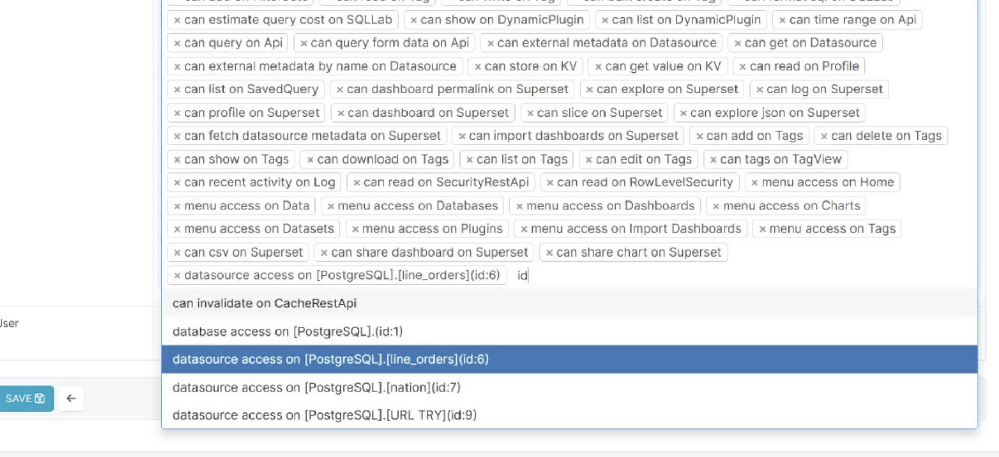

### Embedding Superset Dashboard into Public Website using Simple iFrame

[Superset Documentation for Public User](https://superset.apache.org/docs/security/#public)

In your `superset_config.py` file add

'''

    PUBLIC_ROLE_LIKE = "Gamma"

'''

OR

'''

    PUBLIC_ROLE_LIKE_GAMMA = True

'''

Both of the above variables will create a `Public` Role that will use same permissions as `Gamma` Role. But for my case it did not work I had to create it manually. 

Additionally if you want to copy any other role's permission then you can change above code as follows.

'''

    PUBLIC_ROLE_LIKE = "ENTER_YOUR_ROLE_NAME_HERE"

'''

Once this is added restart superset. You should find Role named `Public` in List of roles along with default and if you have created any then those.

> [!NOTE]  
> For me this Role was created without any permission so I deleted this role and copied `Gamma` Role and renamed it to `Public` 

Now to add dashboard permission we need to add dataset permission in this public role. You can just type `id` in search bar in permissions in role to get list of all Datasets as shown in screenshot below 

Once permission is added you can open dashboard and click on 3 horizontal dots adjacent to EDIT DASHBOARD.
click on Share and "Copy permalink to clipboard" 

Now we have link ready lets embed it into html

for now lets create `index.html` file in a folder. Just copy following code into index.html by replacing url with the url we just copied from above step

'''

<iframe src="REPlACE_YOUR_URL_HERE" height="90%" width="90%" title="Iframe Example"></iframe>

'''

You can tweak height width etc and open html page in browser you should be able to see superset loading. If you have any issue you can contact me on linkedin, Email or any other means that you find comfortable with. 

##### Let's Learn Together! 📖😊

