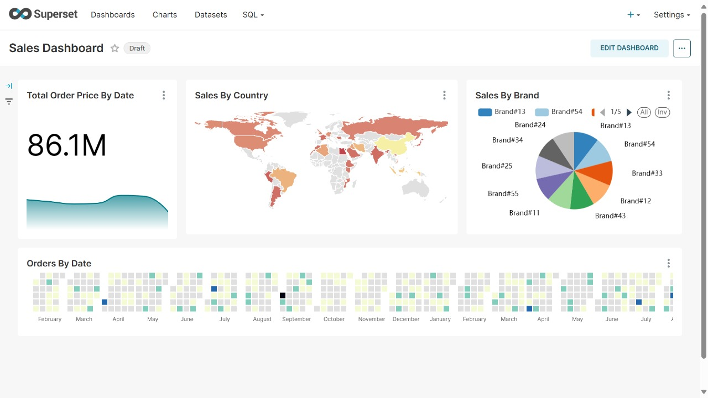
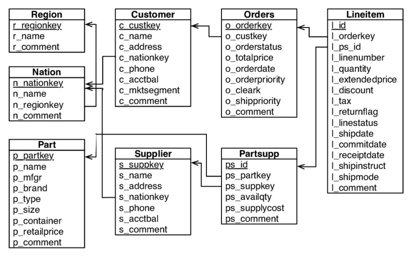

## Reporting with Apache Superset




We will be building above report in apache superset.


To build this report we are using PostgreSQL database. All the data used is generated using TPC dataset generator([TPC Website](https://www.tpc.org/tpc_documents_current_versions/current_specifications5.asp))


#### DATA MODEL

To develope report we need data model as superset does not support modeling like many reporting tools supports. Hence we will be creating a flat view on top of this model. 




### Dashboard Exports
[Sales Dashboard Export (Zip)](./exports/Sales%20Dashboard%20Export.zip)
[Sales Dashboard Export (Unzipped)](./exports/Sales%20Dashboard%20Export/)

### Dataset files (1 GB Ready to be downloaded)
[Kaggle TPC-H 1GN](https://www.kaggle.com/datasets/fven7u/tpch-1gb) 

credit: FrancescoVentura (Owner) [License Unknown] 

### PostgreSQL 
```
SELECT  * ,INITCAP(n_name) as Country
FROM public.lineitem l 
JOIN public.orders o ON l.l_orderkey = o.o_orderkey
JOIN public.partsupp ps on l.l_partkey = ps.ps_partkey
JOIN public.supplier s on ps.ps_suppkey = s.s_suppkey
JOIN public.part pt on ps.ps_partkey = pt.p_partkey
JOIN public.customer cus on o.o_custkey = cus.c_custkey
JOIN public.nation n on cus.c_nationkey = n.n_nationkey
limit 5000

```

&nbsp;
&nbsp;
&nbsp;

[](https://www.buymeacoffee.com/shantanukhond)