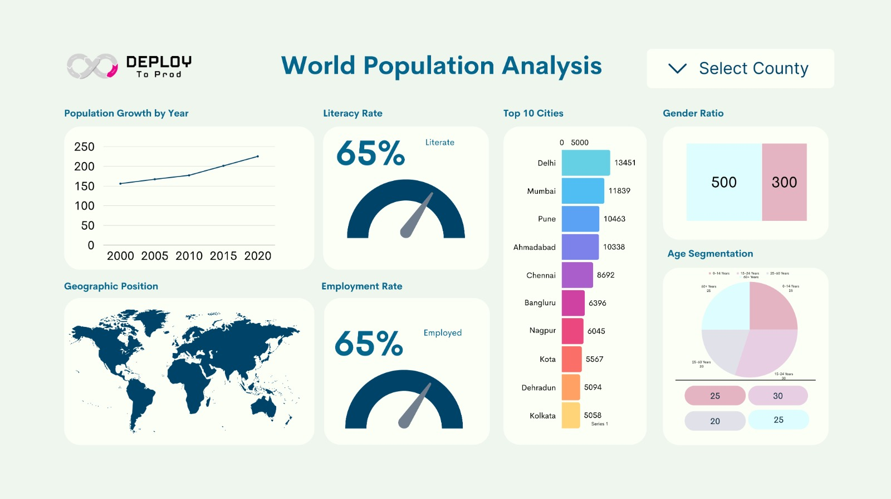

## Reporting with Apache Superset

We will be building above report in apache superset. This template is crafted by [Jitesh Raut](https://github.com/jitesh-raut).

To build this report we are using PostgreSQL database. All the data available in tables are available in [Population Data.xlsx](./Data/Population%20Data.xlsx)

#### DATA MODEL

To develope report we need data model as superset does not support modeling like many reporting tools supports. Hence we will be creating a flat view on top of this model. 

> **Please note:**  Please note as I am doing this manually I have not created proper pk and fk. Joining over string is not advisable and should be avoided if possible. I am only doing it as I am currently only focusing on reporting and data is very small.

I will be placing exports of reports and provide links here.

&nbsp;
&nbsp;
&nbsp;

